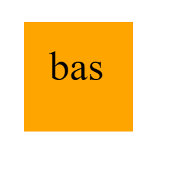

# Logo Generator 

  ## Description
    as a freelance developer, I want to be able to create and display a logo quickly.  With this project, I am able to do so by answering a few simple questions. 

  ## Table of Contents 
   - [Installation](#installation)
   - [Usage](#usage)
   - [License](#license)
   - [Contributing](#contributing)
   - [Tests](#tests)
   - [Questions](#questions)  

  ## Installation
    You must have inquire installed.  And also, nodeJS.
    
  ## Usage
    N/A  

  ## License
    (https://opensource.org/licenses/MIT)
    Copyright <YEAR> <COPYRIGHT HOLDER>

    Permission is hereby granted, free of charge, to any person obtaining a copy of this software and associated documentation files (the “Software”), to deal in the Software without restriction, including without limitation the rights to use, copy, modify, merge, publish, distribute, sublicense, and/or sell copies of the Software, and to permit persons to whom the Software is furnished to do so, subject to the following conditions:
    
    The above copyright notice and this permission notice shall be included in all copies or substantial portions of the Software.
    
    THE SOFTWARE IS PROVIDED “AS IS”, WITHOUT WARRANTY OF ANY KIND, EXPRESS OR IMPLIED, INCLUDING BUT NOT LIMITED TO THE WARRANTIES OF MERCHANTABILITY, FITNESS FOR A PARTICULAR PURPOSE AND NONINFRINGEMENT. IN NO EVENT SHALL THE AUTHORS OR COPYRIGHT HOLDERS BE LIABLE FOR ANY CLAIM, DAMAGES OR OTHER LIABILITY, WHETHER IN AN ACTION OF CONTRACT, TORT OR OTHERWISE, ARISING FROM, OUT OF OR IN CONNECTION WITH THE SOFTWARE OR THE USE OR OTHER DEALINGS IN THE SOFTWARE.
  
  

  ## Contributing
    Anybody can contribute, as they would like.

  ## Screen Shots
  
  
  [Untitled_ May 16, 2023 6_58 PM.webm](https://github.com/abrand93/SVG-Logo-Maker/assets/125417439/bed92283-ff43-4303-ae2b-82817cb4391e)
  ## Testing
    N/A   

  ## questions 
  * GitHub Profile: [GitHub Link](https://github.com/abrand93)
  *  If you have any questions please contact me at: abrandstrom93@gmail.com

